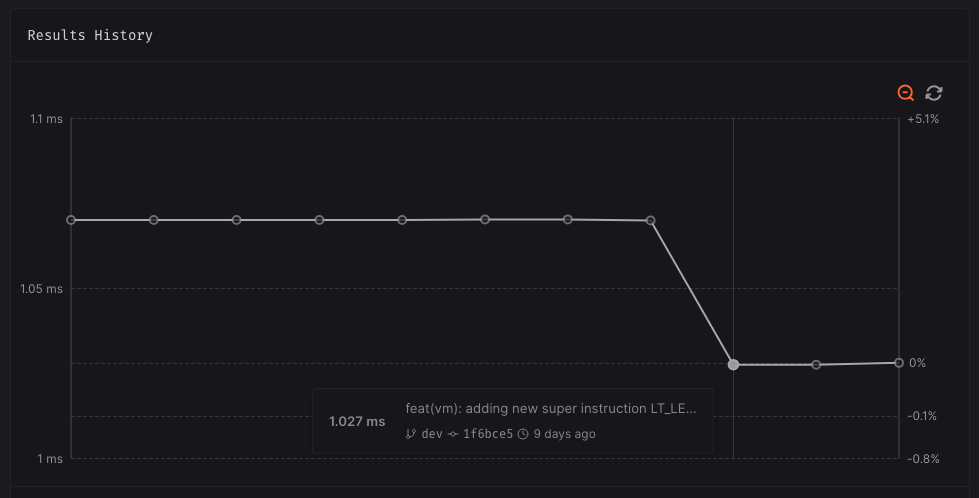

+++
title = 'ArkScript - September 2025 update'
date = 2025-09-02T19:19:45+02:00
tags = []
categories = ['arkscript']
+++

Since my [last update post](), there was a total of 127 new commits, 402 files changed, 4782 insertions, and 2798 deletions. There was a lot of refactoring to make the project cleaner, a new `Dict` datatype, a ton of new tests that helped fix bugs, better position tracking for nodes in the parser, and a few more super instructions for optimization purposes!

## Dictionaries

It has been a few years since I last added a new datatype to ArkScript, and this summer, after doing some Rosetta Code challenges, I finally changed my mind and added a dictionary datatype.

We can create them using the `(dict)` builtin, and manipulate dictionaries using `std.Dict`:

```lisp
(import std.Dict)

(mut data (dict
  "key" "value"
  "count" 5
  12 false))

(print (dict:get data "key"))  # value
(print (dict:get data 1))  # nil

(dict:add data "arkscript" "v4.0.0")
```

There are a lot more way to play with dictionaries, check them out [in the documentation](https://arkscript-lang.dev/docs/std/dict)!

## New instructions and performance improvements

Nowadays, pretty much all new instructions are added for performance reasons, and the new ones are no exception.

Recursive non-tail calls used to refer themselve by name, performing a variable lookup (which was already optimized by adding the variable and its value in the scope of the function). This has been optimized further with an instruction that retrieves the page address of the current page (`GET_CURRENT_PAGE_ADDRESS`), and a super instruction (`CALL_CURRENT_PAGE`) that get the current page and calls it in a single go:


Some new list related super-instructions:

- `STORE_LEN`, to optimize a `(let var (len container))` down to a single instruction
- `LT_LEN_SYM_JUMP_IF_FALSE` to optimize `(while (< i (len container)) {...})`



- `AT_SYM_INDEX_CONST` to optimize `(let container [1 2 3]) (@ container 2)`


## Bug finding: Name resolution

Captures are no longer fully qualified, which makes much more sense from a user point of view (renaming a file won't change the closures' captured names):

```lisp
# vm-tests.ark
(let tests 0)
(let foo 12)
(let closure (fun (&tests &foo) ()))

# before
(test:expect (hasField closure "vm-tests:tests"))
(test:eq (toString closure) "(.vm-tests:tests=0)")
# after
(test:expect (hasField closure "tests"))
(test:eq (toString closure) "(.tests=0)")
```

---

Resolving an unprefixed name could use a prefixed import resolution even though this should be forbidden:

```lisp
(import std.Dict)
(import std.List :forEach)

# wrong forEach being used, seen as coming from dict
(forEach "hello world" (fun (e) (print e)))
```

But invert the import order and it worked:
```lisp
(import std.List :forEach)
(import std.Dict)

(forEach "hello world" (fun (e) (print e)))
```

This was a bug in the name resolution, allowing non-qualified names outside a package to be fully qualified using the package prefix if the name existed inside said package.

## More bugs fixed

- the backtrace generation could be stuck in infinite loops ;
- loading a module was breaking symbol indices used by `LOAD_SYMBOL_BY_INDEX`, and always putting the module's symbols in the global scope (thus potentially erasing the next scope(s)'s variables!) ;
- `DECREMENT_STORE` super instruction couldn't be emitted (and thus `(set i (- i 1))` couldn't be optimized) due to a bad check on the symbol id ;

## Misc

Lastly, in no particular order, these last three months I:

- added Emscripten support, to be able to run ArkScript code in the browser ;
- changed the bytecode layout in the VM, so that it is contiguous, reducing indirections in the VM, improving cache locality and performances ;
- added execution contexts reuse for async when possible. This is important for async-heavy code, so that we don't spend all of our time creating and destroying contexts. The current defaults are 4 additional contexts for async, 1 for the main thread.
- updated the bytecode reader to display the super instructions arguments ;
- revamped the `arkscript` command line: the file to compile and its arguments are now last, configuration (lib dir, debug level...) comes first ;
- added a new macro `$type`, to get types at compile time ;
- refactored the parser and diagnostics generation, to be able to track the start and end position of every node for better error messages ;

