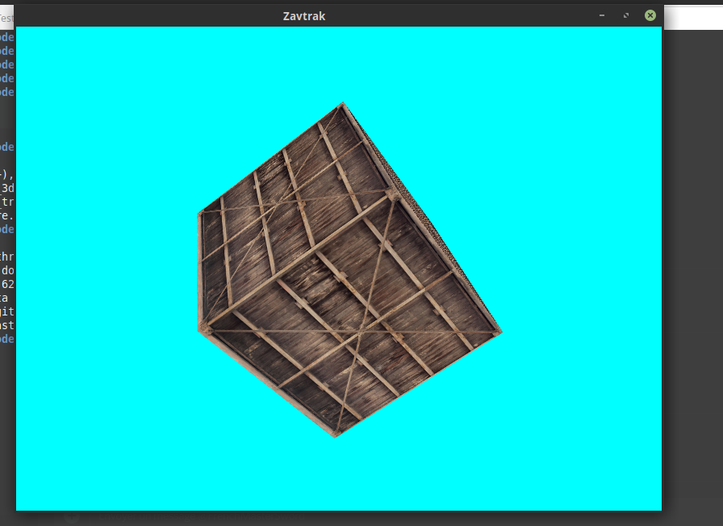

+++
title = 'Lets render chunks of voxels with OpenGL!'
date = 2018-10-13T22:15:52+02:00
draft = false
tags = ['cpp', 'opengl']
categories = ['gamedev']
image = '/cover_image.png'
+++

In my [previous post]( "Making a rendering engine"), I tried to introduce you to my journey: making a game (I forgot to mention that I want to make (more or less) the whole game myself, from the engine to the assets). I am now trying to render *chunks* of *blocks* and... that was harder than I thought !

----

I briefly mention the basic things needed when playing with 3D rendering in OpenGL (VAO, VBO, shaders) in my last post. Starting from that, I tried to add some code to display cubes with my engine :

```cpp
glm::vec3 cubePositions[] = {
    glm::vec3( 0.0f,  0.0f,  0.0f), 
    // ..
};
zk::Vertices vertices({
    // a lot of things 
    // position: 3 floats, texcoords: 2 floats
    -0.5f, -0.5f, -0.5f,  0.0f, 0.0f,
    // ...
});

zk::objects::VertexArray VAO;
zk::objects::VertexBuffer VBO;
VAO.bind();
VBO.setData(vertices);
zk::objects::setVertexAttrib(0, 3, 5, 0);
zk::objects::setVertexAttrib(1, 2, 5, 3);

shader.use();
shader.setUniform1<int>("texture1", 0);
```

And it works !



But a few moments later, I realized I was going nowhere using this : having to move one cube after another will take a long time, so I tried with 4096 of them (it represents a single chunk of 16x16x16 blocks, full of blocks) : I got **16.45**ms, for 60 FPS approximately.

The first optimization I did was to have a single VAO and VBO when drawing x blocks : I had to merge their vertices into one big vertex array to give it all in one batch to OpenGL, and having a single texture and shader, used once to draw them all (instead of having to tell OpenGL to use the block texture, then the block shader, ... 4096 times in our example) :

```cpp
namespace Chunk {
    std::size_t Width = 16, Height = 16, Depth = 16;
}

bool blocks[Chunk::Width][Chunk::Height][Chunk::Depth];
// "map generation"
for (int x=0; x < Chunk::Width; ++x)
{
    for (int y=0; y < Chunk::Height; ++y)
    {
        for (int z=0; z < Chunk::Depth; ++z)
        {
            // putting a block everywhere
            blocks[x][y][z] = true;
        }
    }
}

std::vector<float> temp_vertices;

// for each block, put vertices (moved by x, y, z for the position attributes)
// into temp_vertices
```


New time per update : **5.7** ms. Awesome ! We are far under the 16.67ms limit ! But we can still improve the performances, because we display the hidden faces, the ones between each block, which are not relevant.

Lets hide all the faces if there is an adjacent block :

```cpp
if (x > 0 && blocks[x-1][y][z] == false)
{
    // add face back
    temp_mesh.update(getMeshFace(BlockFace::Back), x-1, y, z);
}
// and so on for the other faces
```

I added a "getMeshFace" function, to be able to get the vertices describing a single face of our cube, to simplify the hidding process. Also you have notice that I am using a `temp_mesh` variable. It is a `Mesh` object, to manipulate the data more easily :

```cpp
struct Mesh {
    std::vector<float> vertices, normals, texcoords;

    void update(const Mesh& other, std::size_t x, std::size_t y, std::size_t z) {
        for (std::size_t i=0; i < other.vertices.size() / 3; ++i)
        {
            vertices.push_back(other.vertices[    i * 3] + x);
            vertices.push_back(other.vertices[1 + i * 3] + y);
            vertices.push_back(other.vertices[2 + i * 3] + z);
        }
        normals.insert(normals.end(), other.normals.begin(), other.normals.end());
        texcoords.insert(texcoords.end(), other.texcoords.begin(), other.texcoords.end());
    }

    std::size_t triangleCount()
    {
        return vertices.size() / 3;
    }
};
```

And you also notice that I added a component "normals", we'll need that later when we'll add some lights (basically, the normals component refers to the normal vector for each mesh).

Time per update : **2.7** ms ! We did it ! As you can see on the cover image, I managed to hide too much faces... This was fixed with the code above hopefully.


(don't be concerned about the weird textures in some place, it's due to my poor management in the texture coordinates, which I messed up a bit, but it can be fixed pretty easily).

We manage to :
* send in one batch all the vertices, representing a chunk, to OpenGL
* avoid sending hidden faces to have even better performances

We could look into *view frustum culling* to display only the cubes seen on screen, but I prefer not to implement that for two reasons :
* my project Voksel doesn't need chunk editing (so I don't need to create a new mesh each second, which can take a lot of time), so I prefer not to add more complexity to the code just to gain a few µs on my update time
* that is quite hard to implement correctly

If you're still interested in learning about *view frustum culling*, I advise you to read [this article](http://www.lighthouse3d.com/tutorials/view-frustum-culling/) (from lighthouse3d).

We could also have implemented *triangle face merging* (I'll call this *TFM*) to have even better performances. TFM is an algorithm grouping all triangles on the same plane, to create a single big one, to reduce the number of vertices to send to OpenGL. This algorithm can take a lot of time to run, especially if your chunks aren't flat.

Fogleman, on his medium page, explains this algorithm pretty well : [Voxel rendering techniques, by Fogleman](https://medium.com/@fogleman/voxel-rendering-techniques-fa8d869457ca).

----

A few lines ago, I wrote that "I added a component "normals", we'll need that later when we'll add some lights", but I didn't use it. We'll see that in the next article :)

PS: if you want to see the sources used for this serie of articles, I created a [Gitlab repository](https://gitlab.com/SuperFola/devto_gl/) for it.
